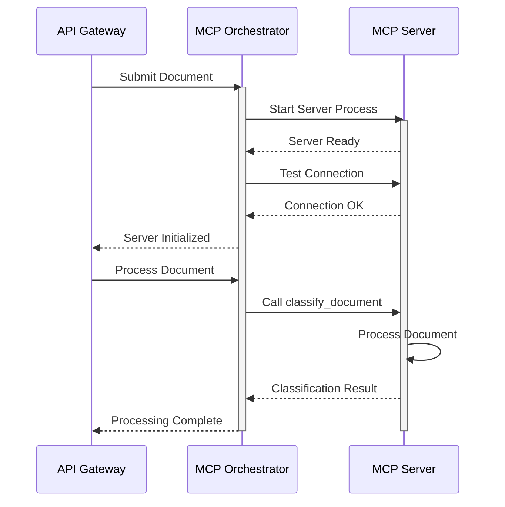
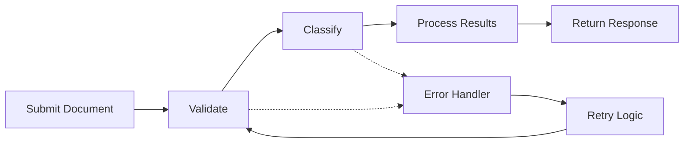
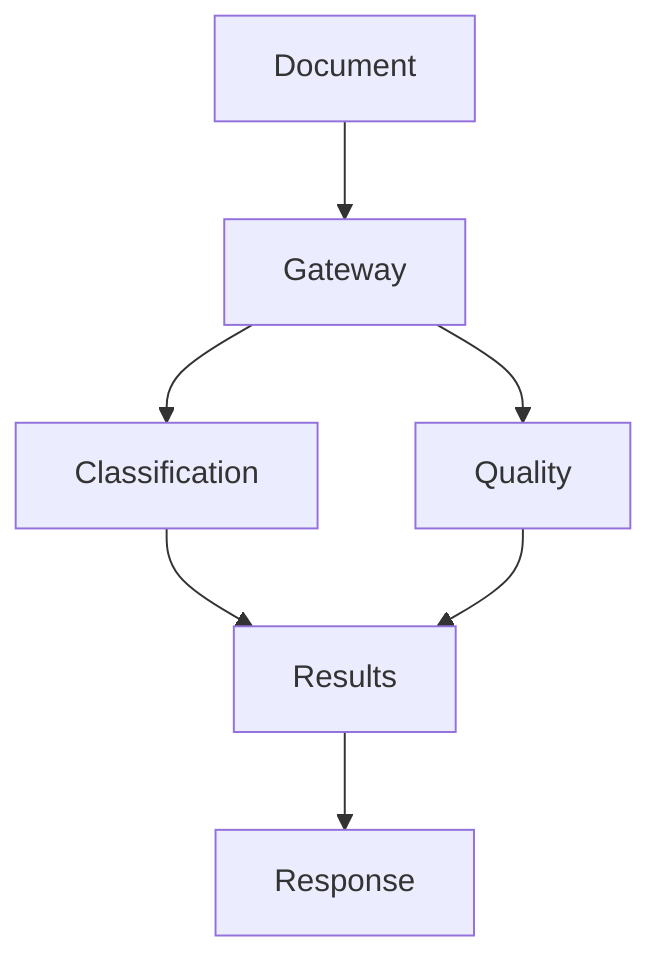

# MCP Workflow Documentation

## Overview

This document describes the workflow and communication patterns in the Model Context Protocol (MCP) system. The system uses a client-server architecture with asynchronous communication.

## Workflow Diagram



## Service States

### 1. Initialization
- Service registration
- Process startup
- Configuration loading
- Tool registration
- Connection testing

### 2. Processing
- Request validation
- Tool execution
- Result formatting
- Error handling
- Response sending

### 3. Error States
- Initialization failed
- Connection lost
- Processing error
- Timeout
- Resource exhaustion

### 4. Shutdown
- Request completion
- Resource cleanup
- Process termination
- Connection closure

## Communication Flow

1. **Document Submission**
   ```
   Client → Gateway → Orchestrator → Server
   ```

2. **Processing Pipeline**
   ```
   Document → Validation → Processing → Results
   ```

3. **Error Handling**
   ```
   Error → Retry → Fallback → Response
   ```

## Common Workflows

### 1. Document Classification



### 2. Multi-Service Processing



## Error Recovery

1. **Connection Issues**
   - Automatic retry
   - Exponential backoff
   - Alternative server
   - Partial results

2. **Processing Errors**
   - Validation retry
   - Error categorization
   - Fallback options
   - Error reporting

## Monitoring Points

1. **Health Checks**
   - Server status
   - Connection state
   - Resource usage
   - Error rates

2. **Performance Metrics**
   - Processing time
   - Queue length
   - Success rate
   - Resource usage

## Configuration Management

1. **Server Configuration**
   ```yaml
   server:
     name: classification
     script: classification_server.py
     timeout: 30.0
     retries: 3
   ```

2. **Client Configuration**
   ```yaml
   client:
     servers:
       - name: classification
         timeout: 30.0
       - name: quality
         timeout: 20.0
   ```

## Best Practices

1. **Request Handling**
   - Validate early
   - Fail fast
   - Retry carefully
   - Log extensively

2. **Error Management**
   - Categorize errors
   - Provide context
   - Handle gracefully
   - Report clearly

3. **Resource Management**
   - Monitor usage
   - Clean up properly
   - Set limits
   - Handle overflow

4. **Performance**
   - Cache results
   - Batch requests
   - Monitor metrics
   - Optimize critical paths
